# CV19_TETUAN

Pagina del Movimiento: [https://covidmadrid.com/](https://covidmadrid.com/)

EPI's -  Impresión 3D

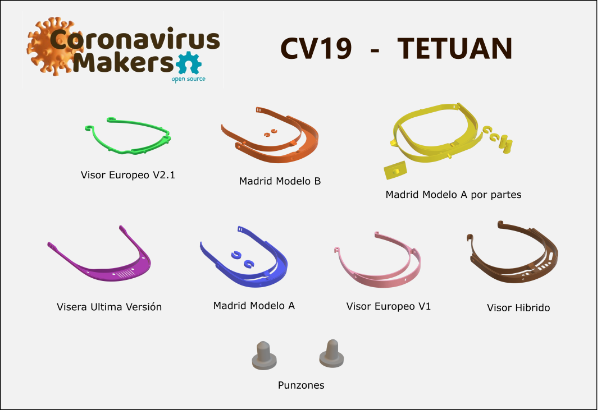

## MODELOS para uso Sanitario/Hospitales/Centros de Salud, et.

Los Modelos A + B necesitan Tornillos de M4x8mm o M5x8-10mm o M6x8-10mm de ACERO INOXIDABLE para fijar las Viseras. 

Para Tornillos de 15mm longitud existe un adaptador.

Para el uso NO SANITARIO se puede tambien substituir con los Punzones

### Madrid Modelo A

El modelo anteriormente acceptado de la Comunidad de Madrid. Tambien llamado "Version homologada"

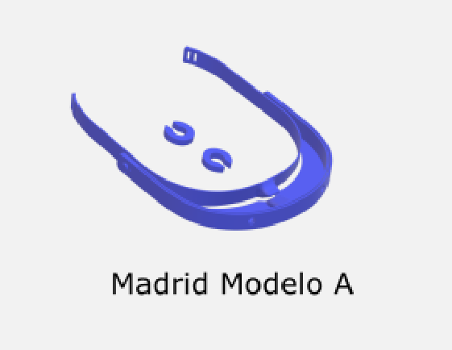

### Madrid Modelo B

El mismo Modelo que la Version A, pero para imprimir en partes para Impresoras mas pequenos o menos fino.

#### Madrid Modelo B V2

El mismo Modelo que la Version B, solo conjuntado para pequenas Impresoras (20x20cm) y con los "" diferente

### Como montar el Modelo A

FOTO ARANDELAS Y TORNILLOS

### Accesorios para Model A

#### Punzones

NO SE PUEDE USAR PARA EL USO SANITARIO!

Las Punzones en cuando se imprimen se tienen que cambiar de Escala 98% a 104%, depende la maquina. 

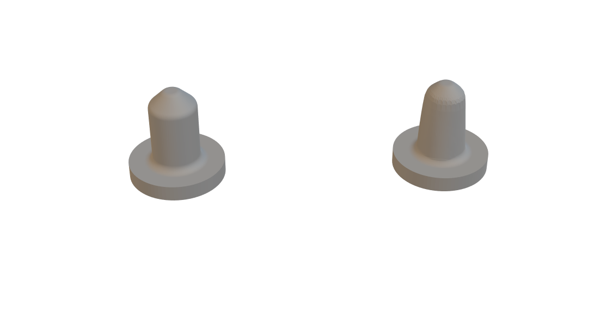

##### Como montar el Punzon 1 en la Visera

  

##### Como tiene que ser el Punzon LH en la Visera

##### Sujecciones Pantalla Acetato ????
 Existe pero no lo hemos comprobado y no sabes como tendria que funcionar.
 
EN TETUAN NO SE USA!

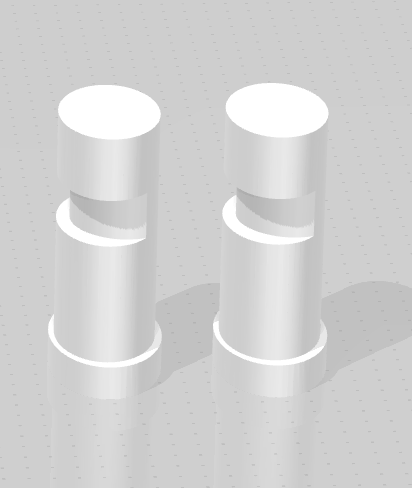

#### Adaptador Tornillos 15mm

Un Adaptador para Tornillos de 15mm. Se mete dentro de la Visera y se aprieta con el Tornillo.

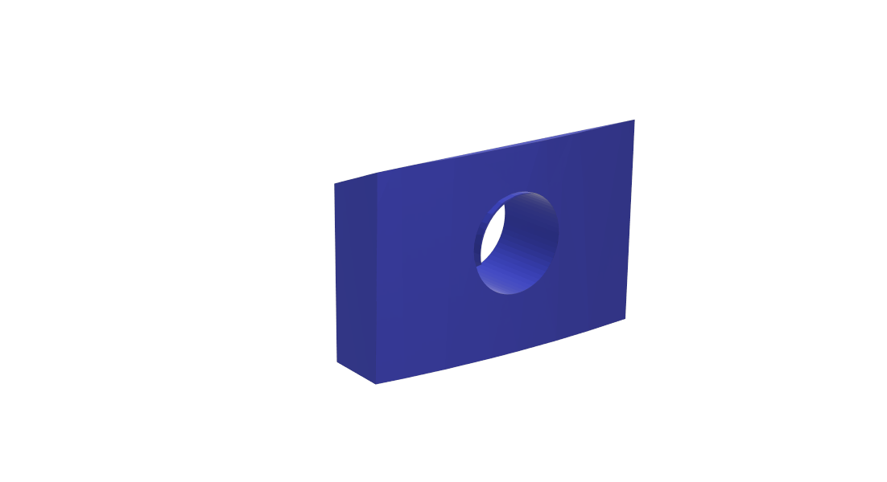

## MODELOS para uso no Sanitario (Residencias, Farmacias, Tiendas, etc)

###  Gregorio Maranon V3

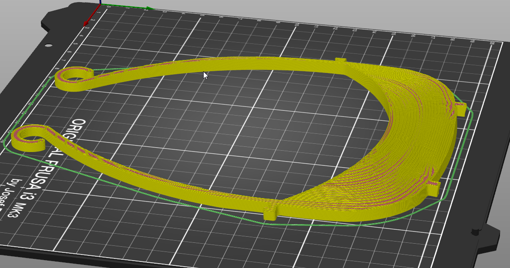

###  Gregorio Maranon V2

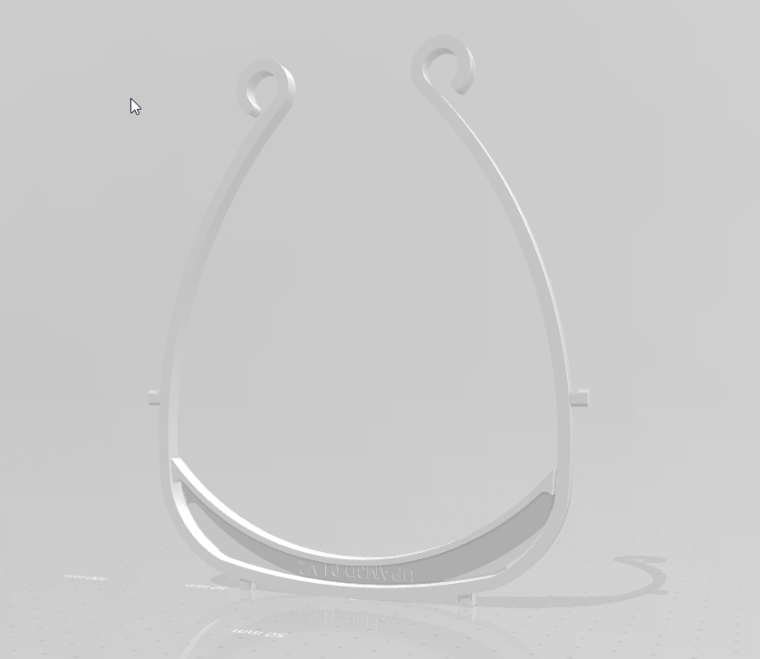

###  Visor Europeo V1

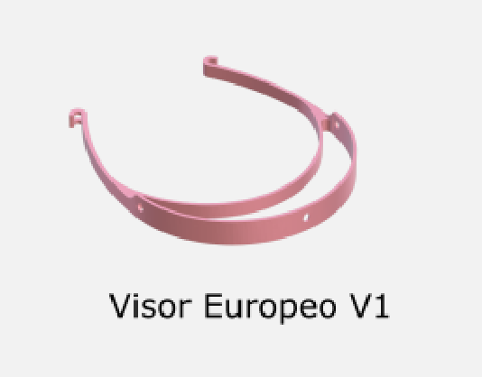

### Visor Europeo V2.1

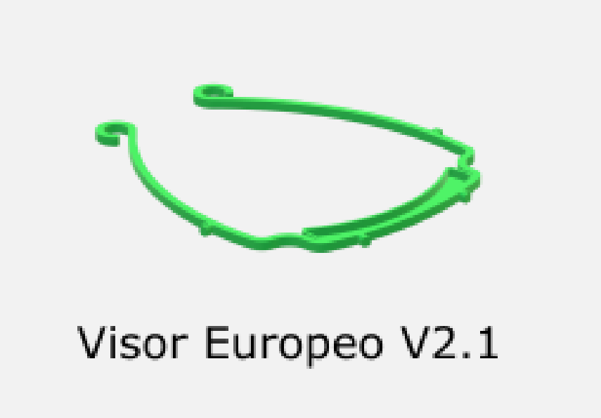

### Visera Plana ultima version

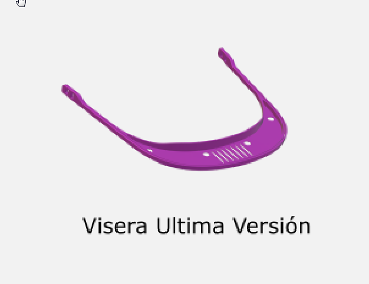

Esta Version no se usa mucho ya porque para fijar las Pantallas PVC se tiene que trabajar con Pegamiento o Soldadura y se quita cuando esta limpiado con Lejilla o Alcool.

NO ACCEPTAMOS ESTAS VISERAS PARA ENTREGAS (en Tetuan)

### Visor Hibrido

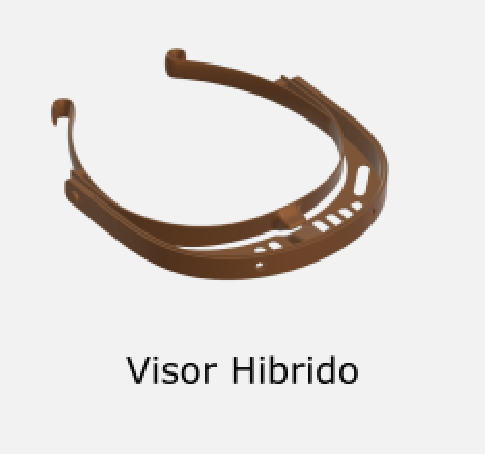

## Tests de Resistencia

TEXT: Lejilla, etc. etc.

  

  

  

## Videos HOWTO

....

## Troubleshooting

### Que hacer cuando no pega el Parte trasera del Modela A.

..…

### Con que Configuraciones imprimir?

..

