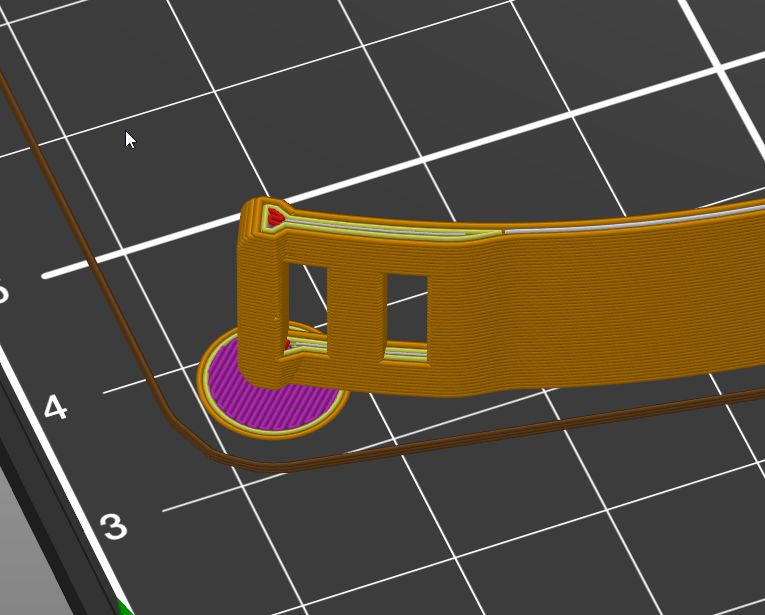
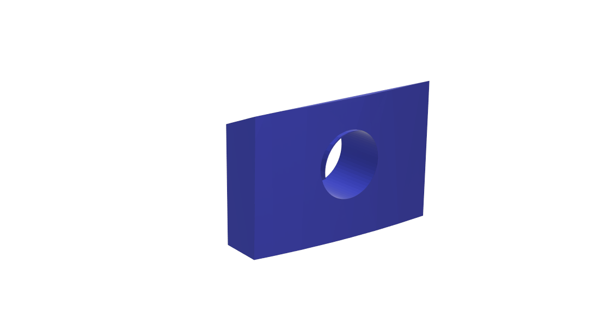
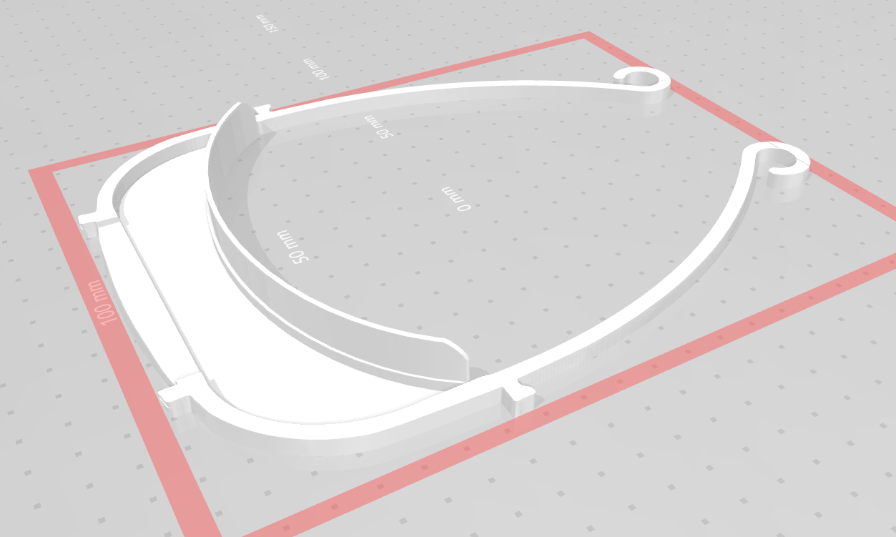
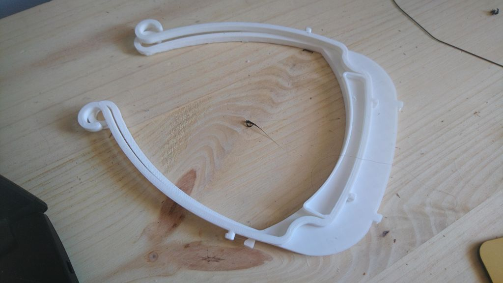
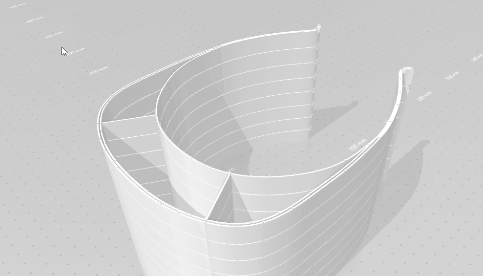
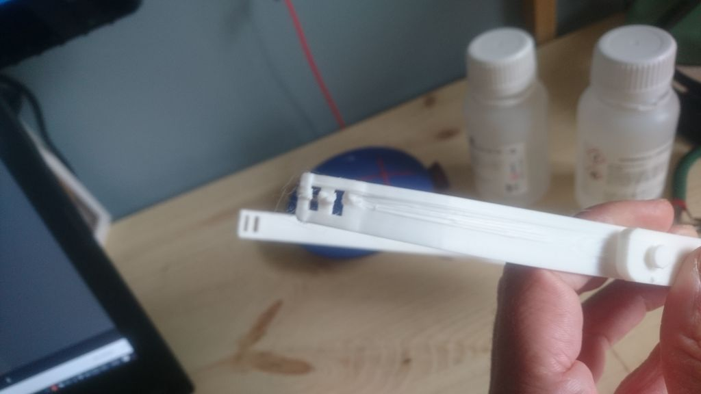
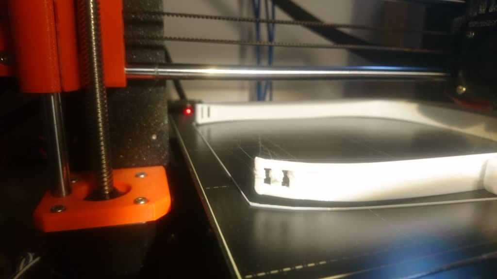

CV19_TETUAN

Pagina del Movimiento: [https://covidmadrid.com/](https://covidmadrid.com/)

EPI's -  Impresión 3D

## MODELOS para uso Sanitario/Hospitales/Centros de Salud, et.

Los Modelos A + B necesitan Tornillos de M4x8mm o M5x8-10mm o M6x8-10mm de ACERO INOXIDABLE para fijar las Viseras. 

Para Tornillos de 15mm longitud existe un adaptador.

Para el uso NO SANITARIO se puede tambien substituir con los Punzones

### Madrid Modelo A

El modelo anteriormente acceptado de la Comunidad de Madrid. Tambien llamado "Version homologada"

- Tiempo de Impresion: 1:44min con Prusa MKS3

Existe un Modelo con Puntos de Fijacion:

[Archivos STL](https://github.com/gabrieldelgadoo/CV19_TETUAN/tree/master/archivos%20STL)

### Madrid Modelo B

El mismo Modelo que la Version A, pero para imprimir en partes para Impresoras mas pequenos o menos fino.

[Archivos STL](https://github.com/gabrieldelgadoo/CV19_TETUAN/tree/master/archivos%20STL)

### Madrid Modelo B V2

El mismo Modelo que la Version B, solo conjuntado para pequenas Impresoras (20x20cm) y con los "" diferente

[Archivos STL](https://github.com/gabrieldelgadoo/CV19_TETUAN/tree/master/archivos%20STL)

### Como montar el Modelo A

<video style="width:50%" controls>
  <source src="videos/arandela.mp4" type="video/mp4">
Your browser does not support the video tag.
</video>

### Accesorios para Model A

#### Punzones

NO SE PUEDE USAR PARA EL USO SANITARIO!

Las Punzones en cuando se imprimen se tienen que cambiar de Escala 98% a 104%, depende la maquina. 

[Archivos STL](https://github.com/gabrieldelgadoo/CV19_TETUAN/tree/master/archivos%20STL)

##### Como montar el Punzon 1 en la Visera

  

##### Como tiene que ser el Punzon LH en la Visera

<video style="width:50%" controls>
  <source src="videos/colocpunzon.mp4" type="video/mp4">
Your browser does not support the video tag.
</video>

##### Sujecciones Pantalla Acetato ????
 Existe pero no lo hemos comprobado y no sabes como tendria que funcionar.
 
EN TETUAN NO SE USA!

#### Adaptador Tornillos 15mm

Un Adaptador para Tornillos de 15mm. Se mete dentro de la Visera y se aprieta con el Tornillo.

[Archivos STL](https://github.com/gabrieldelgadoo/CV19_TETUAN/tree/master/archivos%20STL)

## MODELOS para uso no Sanitario (Residencias, Farmacias, Tiendas, etc)

###  Gregorio Maranon V3_Tetuan

Positivo de la version:
1) mas comodo para el usuario
2) el mismo tiempo de impresion que la V3

- Tiempo de Impresion: 1h (Prusa MKS3)

###  Gregorio Maranon V3

Positivo: No necesita Tornillos
Esta Version deja mas hueco para Gafas que la V2.

- Tiempo de Impresion: 53min (Prusa MKS3)

Comprobado de Resistencia con bano de Lejilla.

[Archivos STL](https://github.com/gabrieldelgadoo/CV19_TETUAN/tree/master/archivos%20STL)

###  Gregorio Maranon V2

Positivo: No necesita Tornillos
- Tiempo de Impresion: 

[Archivos STL](https://github.com/gabrieldelgadoo/CV19_TETUAN/tree/master/archivos%20STL)

### Visor Europeo V2.1

Es una Version de Gregorio Maranon V2, que necesita menos tiempo de Impresion.

- Tiempo de Impresion:

[Archivos STL](https://github.com/gabrieldelgadoo/CV19_TETUAN/tree/master/archivos%20STL)

### Visor Hibrido

- Tiempo de Impresion:

[Archivos STL](https://github.com/gabrieldelgadoo/CV19_TETUAN/tree/master/archivos%20STL)

## MODELOS QUE NO SE USAN! (comprobado)

### Visera Plana ultima version

Esta Version no se usa mucho ya porque para fijar las Pantallas PVC se tiene que trabajar con Pegamiento o Soldadura y se quita cuando esta limpiado con Lejilla o Alcool.

NO ACCEPTAMOS ESTAS VISERAS PARA ENTREGAS (en Tetuan)

[Archivos STL](https://github.com/gabrieldelgadoo/CV19_TETUAN/tree/master/archivos%20STL)

### Visera bescobarca

Este Version es muy rapido pero no se puede asegurar que la Pantalla se queda fijo.

NO ACCEPTAMOS ESTAS VISERAS PARA ENTREGAS (en Tetuan)

[https://www.thingiverse.com/thing:4251325/files](https://www.thingiverse.com/thing:4251325/files)

###  Visor Europeo V1

Este Version es muy rapido pero no se puede asegurar que la Pantalla se queda fijo, si no se usan Tornillos y Tuercas (Punzones no funcionan). Y Tuercas y Tornillos estan escaso y mejor usado para Modelo A+B.

NO ACCEPTAMOS ESTAS VISERAS PARA ENTREGAS (en Tetuan)

## Tests de Calidad

Para el uso Sanitario y tambien no sanitario es muy importante, que las viseras estan de buena calidad.

Que no hay capas mal hechas, etc.

Si ves, que tu modelo tiene imperfecciones tienes que hacer el test de resistencia a ver si puede valer todavia para el uso no sanitario.

Si no es asi, a la basura.

ES MUCHO MEJOR TIRAR UNA VISERA QUE ENTREGARLA EN MAL ESTADO Y PONER EN RIESGO LA GENTE TRABAJANDO!

### Ejemplo Modelo A:
NO VALIDO PARA USO SANITARIO
VALIDO PARA USO NO SANITARIO (Tiendas, etc.), SI pasa el test de Resistencia

###  Ejemplo resistencia de arandelas:

<video style="width:50%" controls>
  <source src="videos/arandela_test.mp4" type="video/mp4">
Your browser does not support the video tag.
</video>

## Tests de Resistencia

Para verificar la calidad de tu diseno hay que hacer multiples cosas.

### ANTES DE ENTREGAR UNA NUEVA VERSION DE VISERAS:
Una vez por diseno y configuracion tienes que hacerte un bano de lejilla (1:10) y submergir la Visera 5-6 horas.

Despues haces estes Tests de Resistencia.

Esto hacemos porque en hospitales etc. las viseras se limpian con lejilla o alcool y es muy importante que aguantan un uso fuerte y abusivo.

Si tu Visera despues de submergirla en la lejilla aguanta de esta manera estas bien:

### CON CADA VISERA ANTES DE ENTREGARLA:

Haces un test de Resistencia rapido.

  

  

  

## Videos HOWTO

....

## Troubleshooting

### Quiero anadir algo

Puedes hacer un Pull Request aqui: [https://github.com/gabrieldelgadoo/CV19_TETUAN](https://github.com/gabrieldelgadoo/CV19_TETUAN)

O escribir a mordondro[]gmail.com o @mordondro en telegram

### Que hacer cuando no pega el Parte trasera del Modela A.

1) Meter Pegamento
2) Intentar imprimir ahi con soportes o brim

O tambien existe un Modelo con Puntos de Fijacion:

[Archivos STL](https://github.com/gabrieldelgadoo/CV19_TETUAN/tree/master/archivos%20STL)

### Con que Configuraciones imprimir?

Hay un parte para configuraciones en este

